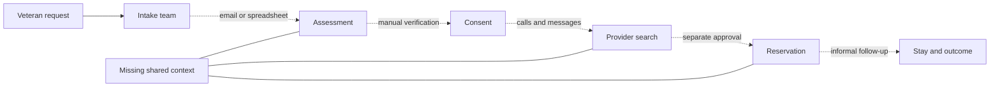
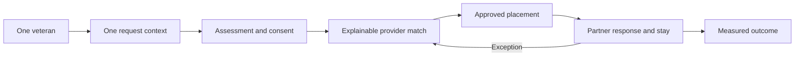

# Chapter 1: The Coordination Gap

> A request can be entered in seconds. Coordinated care begins with everything that must happen next.

At 8:17 on a Tuesday morning, a care coordinator receives an urgent request for a veteran who needs temporary lodging near a medical facility.

The facts appear straightforward. The veteran needs a room. The requested location is in South Jersey. The anticipated stay is short. Transportation may be required, and a ground-floor room would reduce risk. A community partner has supplied the referral.

Yet the request is not a reservation.

Before anyone can confirm a safe placement, the coordinator must answer a chain of questions. Is the veteran eligible for the program? Is the request complete? Has the veteran authorized the necessary information sharing? Which providers serve the requested area? Which locations have current availability? Can they accommodate the veteran's accessibility and transportation needs? Is the nightly rate allowable? Who can approve the funding? Has the provider accepted the placement? Has the veteran received the instructions? What happens if the room becomes unavailable, the veteran misses check-in, or the stay must be extended?

No single question is unusual. The difficulty comes from having to answer all of them quickly, across organizational boundaries, while preserving dignity, privacy, and accountability.

This is the coordination gap.

It is the distance between receiving a request and producing a verified outcome. It appears whenever the people, data, decisions, and deadlines required to provide care are distributed across disconnected systems. A referral may live in an email. Eligibility may be documented in a case-management system. Provider availability may be tracked in a spreadsheet. Consent may be stored as a scanned form. Funding approval may occur in a separate portal. Check-in confirmation may arrive through a phone call or text message. Reporting may happen weeks later, after staff attempt to reconstruct the journey.

Each tool can perform its individual task. The gap remains because no one can easily see the whole journey.

## The Request Is Not The Journey

Organizations often design services around transactions. A person submits a form. A coordinator creates a case. A provider receives a referral. A manager approves funding. A report counts the final outcome.

For the veteran, however, these are not separate transactions. They are moments in one experience.

The veteran does not experience an intake database, a provider spreadsheet, an approval queue, and a reporting dashboard. The veteran experiences uncertainty or clarity. Repetition or continuity. Silence or communication. A safe room or another night without one.

That difference matters because a process can appear successful inside each department while failing across the complete journey. Intake staff may submit the referral correctly. A provider may update inventory correctly. A manager may approve the funding correctly. Yet the placement can still fail if the approval arrives after the hold expires or the veteran never receives accessible check-in instructions.

The work of coordination lives between the transactions.

It includes the handoff from intake to assessment, from assessment to consent, from consent to provider matching, from matching to approval, from approval to reservation, and from reservation to arrival. It also includes the return paths: a provider decline, an expired hold, a missed check-in, an early checkout, a funding exception, or a request for additional nights.

When those handoffs are invisible, staff compensate with memory, personal notes, repeated calls, and informal relationships. Dedicated people make the system work, but they do so by carrying coordination in their heads.

That is neither sustainable nor fair.

## A Network Without A Shared Picture

Supported-care networks are rarely controlled by one organization. They may include government programs, community organizations, housing providers, hotels, shelters, medical facilities, transportation partners, funding authorities, and case managers. Each participant has a valid but incomplete view.

The intake team sees what the veteran requested. The assessment team sees vulnerability and eligibility. The consent steward sees what information may be shared and for what purpose. Providers see their own units and operational constraints. Case managers see open tasks, approvals, and risks. Program leaders see totals, trends, and outcomes.

Problems emerge when the network lacks a reliable way to connect those views.

The dotted lines in this picture represent more than technical integration problems. They represent opportunities for information to become delayed, misunderstood, duplicated, or lost.

A provider may report availability without knowing that the veteran needs a wheelchair-accessible room. A case manager may see an active consent without noticing that it expires before the planned stay ends. A funding reviewer may approve seven nights while the provider expects ten. A coordinator may continue calling a location that already declined the reservation. A program leader may count a placement without knowing that the veteran never checked in.

The absence of a shared picture creates six recurring gaps.

### 1. The Identity And Context Gap

The same person may appear differently across systems. A name may be entered with an initial in one record and a full middle name in another. A household member may be included in the request but not in the placement. A new referral may duplicate an active case.

Without a dependable person and household context, teams risk asking the veteran to repeat the same information, creating duplicate work, or making decisions from an incomplete history.

### 2. The Priority And Eligibility Gap

Urgency is not always the same as eligibility, and a calculated score is not the same as a final decision. A veteran may face an immediate safety risk while documentation is still pending. A standardized assessment may recommend one priority while a qualified reviewer identifies a reason for an override.

When the calculation, reasons, override, and accountable reviewer are not visible together, priority can become either rigid or arbitrary.

### 3. The Consent Gap

Care coordination requires information sharing, but not every organization needs every category of information. Consent has a purpose, a permitted recipient, an effective period, and the possibility of revocation.

A checkbox that merely says "consent on file" is not enough. Teams need to know what may be shared, with whom, for what reason, and whether that authorization is still active at the moment of disclosure.

### 4. The Capacity Gap

A provider's total capacity does not answer the question a coordinator must resolve. The useful question is whether a suitable unit is available for this veteran, in this location, for these dates, with the required accessibility and support.

Inventory also changes. A unit that was available this morning may be held, reserved, occupied, or unavailable by the afternoon. Without freshness, hold expiration, and conflict visibility, a list of providers creates the illusion of choice without operational certainty.

### 5. The Decision And Handoff Gap

A match is not a placement. The process still requires a hold, approval, provider acceptance, reservation, veteran acknowledgment, instructions, and arrival confirmation.

Every handoff needs an owner, a deadline, a status, and an expected response. Otherwise, a task can remain technically open while everyone assumes someone else is handling it.

### 6. The Outcome Gap

Organizations often know how many requests they received but struggle to explain what happened next. How many reached a confirmed placement? How long did that take? How many providers declined? How often did inventory fail? How many stays required extensions or urgent relocation? Which communication channels failed?

If the journey is reconstructed only for reporting, the organization learns too late. Operational data should help teams intervene while care is still underway.

## The Human Cost Of Fragmentation

The coordination gap affects every participant, but not in the same way.

For the veteran, fragmentation creates repetition and uncertainty. The person may need to explain the same housing crisis to several people, provide the same documents more than once, or wait without knowing whether the next call will bring a decision. A failed handoff can feel like a personal rejection even when the real cause is an expired hold or an incomplete approval.

For the coordinator, fragmentation produces invisible labor. Staff search inboxes, compare spreadsheets, leave messages, transcribe updates, and maintain private reminders. They may spend more time proving what happened than helping determine what should happen next.

For the provider, fragmentation creates ambiguous commitments. A provider may be asked to hold a unit without a clear deadline, funding authorization, or final guest details. When requests arrive through multiple channels, staff can struggle to distinguish a preliminary inquiry from an approved reservation.

For program leaders, fragmentation weakens accountability. A dashboard can show that demand is rising without identifying where the process is slowing. Leaders may see low placement numbers but lack the evidence needed to distinguish capacity shortages, approval delays, provider declines, communication failures, or data-quality problems.

The result is a system that depends on heroic effort. Heroic effort can resolve today's crisis, but it cannot become tomorrow's operating model.

## From Transactions To Continuity

BeaResponseCare begins with a different unit of design: the coordinated journey.

Instead of treating intake, assessment, consent, provider search, placement, and monitoring as unrelated modules, it connects them through shared identifiers and visible relationships. A veteran record can link to a request. The request can link to an assessment and consent. A case can connect the request to a provider. A placement can carry the decision through six operational steps. Partner work can capture responses, deadlines, notifications, extensions, and exceptions.

The objective is not to place every detail on one screen. The objective is to make the relationships visible enough that a qualified person can understand the current state, the next action, and the reason behind the decision.

This shift changes the questions a system should answer.

Instead of asking, "Was the form submitted?" it should ask, "What must happen for this request to become a safe placement?"

Instead of asking, "Does the provider have capacity?" it should ask, "Is a suitable unit available, current, and holdable for this request?"

Instead of asking, "Was consent captured?" it should ask, "Is this specific disclosure permitted for this recipient and purpose right now?"

Instead of asking, "Was the referral sent?" it should ask, "Did the provider respond, did the veteran receive the information, and was the handoff completed?"

Instead of asking, "How many placements did we report?" it should ask, "What helped or prevented people from reaching stable outcomes?"

## Six Principles For Coordinated Care

The BeaResponseCare model is built around six principles that will guide the rest of this book.

### Principle 1: One Journey, Connected Records

No single record can represent an entire care experience. A useful system does not force everything into one oversized form. It maintains focused records and makes their relationships visible.

The veteran, household, request, assessment, consent, provider, unit, case, placement, and partner task remain distinct because each has its own purpose and lifecycle. They become powerful when a user can move between them without losing context.

### Principle 2: Local Action, Shared Accountability

Care work often happens under imperfect connectivity, incomplete integrations, and evolving policies. Staff still need to capture decisions and continue working.

A local-first approach allows a user to create drafts, save additions, and preserve updates in the browser. Shared submission then becomes a deliberate operation with an identity, timestamp, actor, role, tenant, and response receipt. Local resilience does not eliminate shared accountability; it makes the boundary explicit.

### Principle 3: Explain Decisions

Scores, recommendations, and automated routing can support staff, but they should not conceal reasoning. A match should show why a provider was recommended. A priority should preserve both the calculated recommendation and any authorized override. A decline should include a reason. An escalation should identify the missed deadline.

Explainability helps users challenge bad assumptions, improve data quality, and defend appropriate decisions.

### Principle 4: Close Every Handoff

Sending information is not the same as completing a handoff. A closed-loop process records the expected response, accountable owner, deadline, outcome, and next action.

This is especially important when several organizations participate. A provider response, funding decision, notification delivery, extension review, and exception resolution should not disappear into free-text notes.

### Principle 5: Share The Minimum Necessary

Coordination does not justify unlimited access. The system should make purpose and permission visible at the moment information is used.

Consent, role, organization, and tenant context provide a starting point. Production systems must add authenticated identity, server-enforced authorization, audit review, retention controls, and the applicable legal and program safeguards.

### Principle 6: Learn While The Work Is Happening

Operational measurement should not wait for the end of the month. Teams need to see overdue responses, failed notifications, expiring holds, unresolved exceptions, and capacity constraints while there is still time to intervene.

Reporting is therefore not a separate final step. It is the accumulated evidence of the journey.

## What BeaResponseCare Changes

Consider the simulated case of Jordan Edwards, which will serve as the narrative thread in the next chapter.

Jordan's medical-travel request is represented by `REQ-26259`. The request is connected to Veteran 360 record `VET-30259`, case `CASE-11259`, consent `CNS-50489`, and coordinated-entry assessment `CEA-40489`. The case produces placement `PLC-11259`, and a downstream reservation exception is tracked as partner work item `P1-70489`.

These identifiers are not the story. They are the stitching that prevents the story from being separated into unrelated fragments.

With the records connected, a coordinator can see that the request is for medical travel in Vineland, that accessibility and transportation matter, that consent is active for a housing referral, that a provider has been associated with the case, and that a reservation decline still requires resolution. The coordinator can review related information without searching through multiple inboxes or asking Jordan to start over.

The system does not make the decision on the coordinator's behalf. It makes the state of the decision visible.

That distinction is essential.

## Technology Cannot Coordinate Care By Itself

It is tempting to describe coordination as a software problem. Software matters, but the hardest questions are operational and human.

Who is authorized to override a priority? How quickly must a provider respond? When should an expiring hold escalate? What information does a provider truly need? Who owns a failed notification? What evidence confirms check-in? When does an extension require a new approval? Which outcomes matter to veterans, not only to programs?

A digital platform can encode answers, expose inconsistencies, and preserve evidence. It cannot create trust between organizations that have not agreed on responsibilities. It cannot compensate for unclear policy. It cannot determine dignity from a dropdown list. It cannot replace a coordinator's judgment when the available data fails to describe the person's circumstances.

The purpose of BeaResponseCare is not to automate compassion. It is to remove avoidable confusion so people have more capacity to practice it.

## A Better Starting Point

Organizations do not need to replace every system before improving coordination. They can begin by making the journey explicit.

Choose one common request type. Map every decision from referral to outcome. Identify the records, organizations, handoffs, deadlines, and exceptions involved. Ask where staff rely on memory or personal notes. Ask where the veteran must repeat information. Ask which status labels hide more than they reveal. Ask what evidence would allow the next person to act confidently.

Then define the smallest shared picture that can support the work.

That picture should answer five questions:

1. Who is this journey for?
2. What is the current need and priority?
3. What permissions and constraints apply?
4. Who owns the next action, and when is it due?
5. What outcome occurred, and what should happen next?

If a system cannot answer those questions, adding more forms will not close the gap.

## Chapter Takeaways

- The coordination gap is the distance between receiving a request and producing a verified, accountable outcome.
- Veterans experience one journey even when organizations manage it through many separate transactions.
- Fragmentation creates identity, priority, consent, capacity, handoff, and outcome gaps.
- Connected records are more useful than either isolated systems or one oversized form.
- Explainable decisions and closed-loop handoffs support, rather than replace, professional judgment.
- Local resilience, shared accountability, privacy, and operational measurement must be designed together.
- Technology can make coordination visible, but organizations must still define responsibility, policy, and trust.

## Reflection Questions

1. Where does your organization currently lose visibility between referral and confirmed outcome?
2. Which handoffs depend most heavily on email, spreadsheets, phone calls, or individual memory?
3. How many times must a person repeat the same information during one service journey?
4. Can staff explain why a request received its priority and why a provider was selected?
5. How does your organization know that a referral, notification, or reservation was actually completed?
6. Which exceptions become visible only after they affect a monthly report?
7. What is the smallest connected record view that would help your teams act with greater confidence?

## Next: One Veteran, One Journey

Chapter 2 follows Jordan Edwards from an initial medical-travel request through identity, assessment, consent, provider matching, placement, and exception resolution. The goal is not to demonstrate every field in a system. It is to show how connected context changes the decisions people can make at each step.

