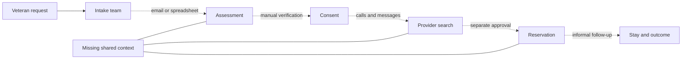
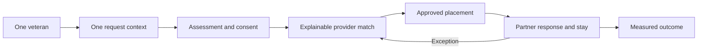
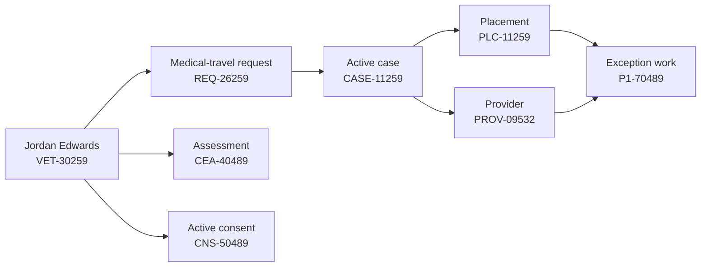
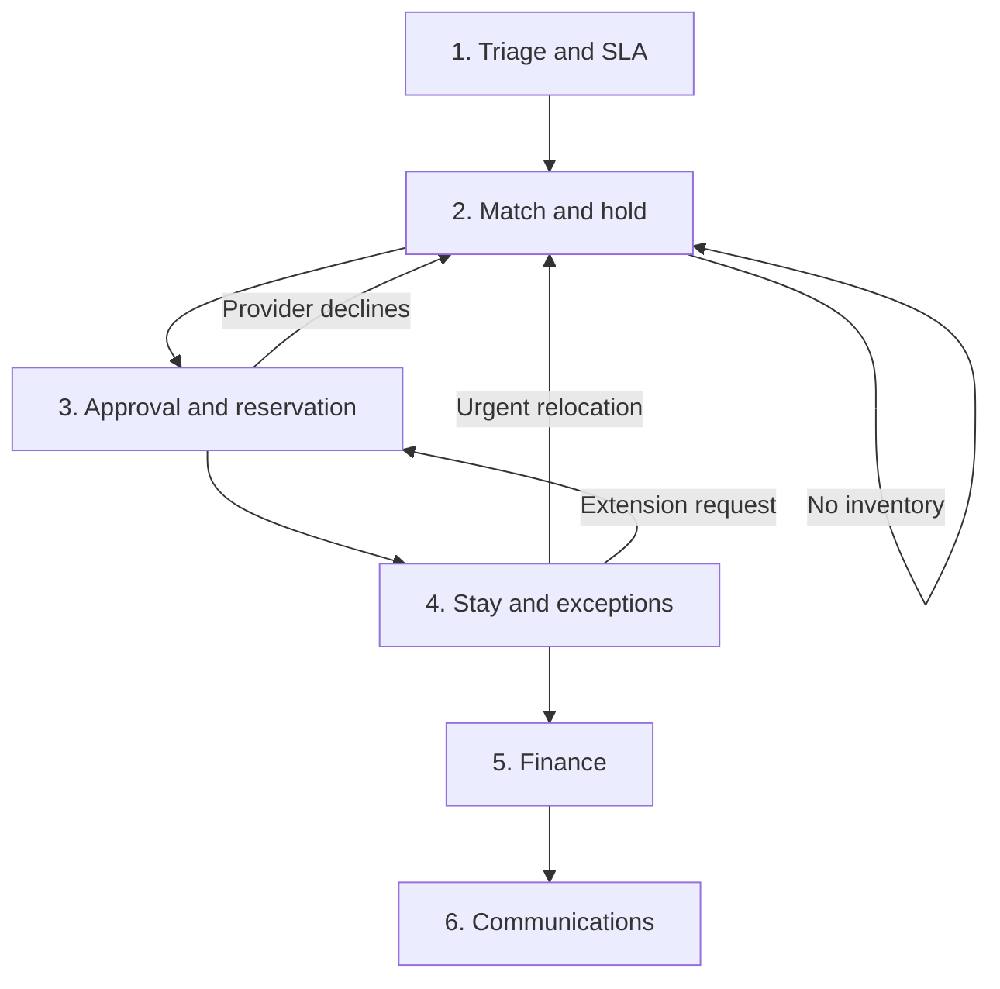
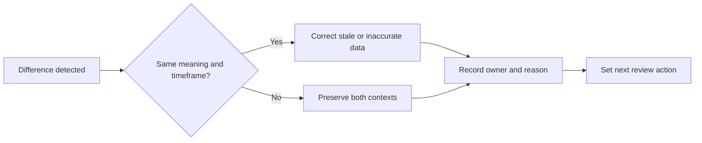

# Chapter 1: The Coordination Gap

> A request can be entered in seconds. Coordinated care begins with everything that must happen next.

At 8:17 on a Tuesday morning, a care coordinator receives an urgent request for a veteran who needs temporary lodging near a medical facility.

The facts appear straightforward. The veteran needs a room. The requested location is in South Jersey. The anticipated stay is short. Transportation may be required, and a ground-floor room would reduce risk. A community partner has supplied the referral.

Yet the request is not a reservation.

Before anyone can confirm a safe placement, the coordinator must answer a chain of questions. Is the veteran eligible for the program? Is the request complete? Has the veteran authorized the necessary information sharing? Which providers serve the requested area? Which locations have current availability? Can they accommodate the veteran's accessibility and transportation needs? Is the nightly rate allowable? Who can approve the funding? Has the provider accepted the placement? Has the veteran received the instructions? What happens if the room becomes unavailable, the veteran misses check-in, or the stay must be extended?

No single question is unusual. The difficulty comes from having to answer all of them quickly, across organizational boundaries, while preserving dignity, privacy, and accountability.

This is the coordination gap.

It is the distance between receiving a request and producing a verified outcome. It appears whenever the people, data, decisions, and deadlines required to provide care are distributed across disconnected systems. A referral may live in an email. Eligibility may be documented in a case-management system. Provider availability may be tracked in a spreadsheet. Consent may be stored as a scanned form. Funding approval may occur in a separate portal. Check-in confirmation may arrive through a phone call or text message. Reporting may happen weeks later, after staff attempt to reconstruct the journey.

Each tool can perform its individual task. The gap remains because no one can easily see the whole journey.

## The Request Is Not The Journey

Organizations often design services around transactions. A person submits a form. A coordinator creates a case. A provider receives a referral. A manager approves funding. A report counts the final outcome.

For the veteran, however, these are not separate transactions. They are moments in one experience.

The veteran does not experience an intake database, a provider spreadsheet, an approval queue, and a reporting dashboard. The veteran experiences uncertainty or clarity. Repetition or continuity. Silence or communication. A safe room or another night without one.

That difference matters because a process can appear successful inside each department while failing across the complete journey. Intake staff may submit the referral correctly. A provider may update inventory correctly. A manager may approve the funding correctly. Yet the placement can still fail if the approval arrives after the hold expires or the veteran never receives accessible check-in instructions.

The work of coordination lives between the transactions.

It includes the handoff from intake to assessment, from assessment to consent, from consent to provider matching, from matching to approval, from approval to reservation, and from reservation to arrival. It also includes the return paths: a provider decline, an expired hold, a missed check-in, an early checkout, a funding exception, or a request for additional nights.

When those handoffs are invisible, staff compensate with memory, personal notes, repeated calls, and informal relationships. Dedicated people make the system work, but they do so by carrying coordination in their heads.

That is neither sustainable nor fair.

## A Network Without A Shared Picture

Supported-care networks are rarely controlled by one organization. They may include government programs, community organizations, housing providers, hotels, shelters, medical facilities, transportation partners, funding authorities, and case managers. Each participant has a valid but incomplete view.

The intake team sees what the veteran requested. The assessment team sees vulnerability and eligibility. The consent steward sees what information may be shared and for what purpose. Providers see their own units and operational constraints. Case managers see open tasks, approvals, and risks. Program leaders see totals, trends, and outcomes.

Problems emerge when the network lacks a reliable way to connect those views.

The dotted lines in this picture represent more than technical integration problems. They represent opportunities for information to become delayed, misunderstood, duplicated, or lost.

A provider may report availability without knowing that the veteran needs a wheelchair-accessible room. A case manager may see an active consent without noticing that it expires before the planned stay ends. A funding reviewer may approve seven nights while the provider expects ten. A coordinator may continue calling a location that already declined the reservation. A program leader may count a placement without knowing that the veteran never checked in.

The absence of a shared picture creates six recurring gaps.

### 1. The Identity And Context Gap

The same person may appear differently across systems. A name may be entered with an initial in one record and a full middle name in another. A household member may be included in the request but not in the placement. A new referral may duplicate an active case.

Without a dependable person and household context, teams risk asking the veteran to repeat the same information, creating duplicate work, or making decisions from an incomplete history.

### 2. The Priority And Eligibility Gap

Urgency is not always the same as eligibility, and a calculated score is not the same as a final decision. A veteran may face an immediate safety risk while documentation is still pending. A standardized assessment may recommend one priority while a qualified reviewer identifies a reason for an override.

When the calculation, reasons, override, and accountable reviewer are not visible together, priority can become either rigid or arbitrary.

### 3. The Consent Gap

Care coordination requires information sharing, but not every organization needs every category of information. Consent has a purpose, a permitted recipient, an effective period, and the possibility of revocation.

A checkbox that merely says "consent on file" is not enough. Teams need to know what may be shared, with whom, for what reason, and whether that authorization is still active at the moment of disclosure.

### 4. The Capacity Gap

A provider's total capacity does not answer the question a coordinator must resolve. The useful question is whether a suitable unit is available for this veteran, in this location, for these dates, with the required accessibility and support.

Inventory also changes. A unit that was available this morning may be held, reserved, occupied, or unavailable by the afternoon. Without freshness, hold expiration, and conflict visibility, a list of providers creates the illusion of choice without operational certainty.

### 5. The Decision And Handoff Gap

A match is not a placement. The process still requires a hold, approval, provider acceptance, reservation, veteran acknowledgment, instructions, and arrival confirmation.

Every handoff needs an owner, a deadline, a status, and an expected response. Otherwise, a task can remain technically open while everyone assumes someone else is handling it.

### 6. The Outcome Gap

Organizations often know how many requests they received but struggle to explain what happened next. How many reached a confirmed placement? How long did that take? How many providers declined? How often did inventory fail? How many stays required extensions or urgent relocation? Which communication channels failed?

If the journey is reconstructed only for reporting, the organization learns too late. Operational data should help teams intervene while care is still underway.

## The Human Cost Of Fragmentation

The coordination gap affects every participant, but not in the same way.

For the veteran, fragmentation creates repetition and uncertainty. The person may need to explain the same housing crisis to several people, provide the same documents more than once, or wait without knowing whether the next call will bring a decision. A failed handoff can feel like a personal rejection even when the real cause is an expired hold or an incomplete approval.

For the coordinator, fragmentation produces invisible labor. Staff search inboxes, compare spreadsheets, leave messages, transcribe updates, and maintain private reminders. They may spend more time proving what happened than helping determine what should happen next.

For the provider, fragmentation creates ambiguous commitments. A provider may be asked to hold a unit without a clear deadline, funding authorization, or final guest details. When requests arrive through multiple channels, staff can struggle to distinguish a preliminary inquiry from an approved reservation.

For program leaders, fragmentation weakens accountability. A dashboard can show that demand is rising without identifying where the process is slowing. Leaders may see low placement numbers but lack the evidence needed to distinguish capacity shortages, approval delays, provider declines, communication failures, or data-quality problems.

The result is a system that depends on heroic effort. Heroic effort can resolve today's crisis, but it cannot become tomorrow's operating model.

## From Transactions To Continuity

BeaResponseCare begins with a different unit of design: the coordinated journey.

Instead of treating intake, assessment, consent, provider search, placement, and monitoring as unrelated modules, it connects them through shared identifiers and visible relationships. A veteran record can link to a request. The request can link to an assessment and consent. A case can connect the request to a provider. A placement can carry the decision through six operational steps. Partner work can capture responses, deadlines, notifications, extensions, and exceptions.

The objective is not to place every detail on one screen. The objective is to make the relationships visible enough that a qualified person can understand the current state, the next action, and the reason behind the decision.

This shift changes the questions a system should answer.

Instead of asking, "Was the form submitted?" it should ask, "What must happen for this request to become a safe placement?"

Instead of asking, "Does the provider have capacity?" it should ask, "Is a suitable unit available, current, and holdable for this request?"

Instead of asking, "Was consent captured?" it should ask, "Is this specific disclosure permitted for this recipient and purpose right now?"

Instead of asking, "Was the referral sent?" it should ask, "Did the provider respond, did the veteran receive the information, and was the handoff completed?"

Instead of asking, "How many placements did we report?" it should ask, "What helped or prevented people from reaching stable outcomes?"

## Six Principles For Coordinated Care

The BeaResponseCare model is built around six principles that will guide the rest of this book.

### Principle 1: One Journey, Connected Records

No single record can represent an entire care experience. A useful system does not force everything into one oversized form. It maintains focused records and makes their relationships visible.

The veteran, household, request, assessment, consent, provider, unit, case, placement, and partner task remain distinct because each has its own purpose and lifecycle. They become powerful when a user can move between them without losing context.

### Principle 2: Local Action, Shared Accountability

Care work often happens under imperfect connectivity, incomplete integrations, and evolving policies. Staff still need to capture decisions and continue working.

A local-first approach allows a user to create drafts, save additions, and preserve updates in the browser. Shared submission then becomes a deliberate operation with an identity, timestamp, actor, role, tenant, and response receipt. Local resilience does not eliminate shared accountability; it makes the boundary explicit.

### Principle 3: Explain Decisions

Scores, recommendations, and automated routing can support staff, but they should not conceal reasoning. A match should show why a provider was recommended. A priority should preserve both the calculated recommendation and any authorized override. A decline should include a reason. An escalation should identify the missed deadline.

Explainability helps users challenge bad assumptions, improve data quality, and defend appropriate decisions.

### Principle 4: Close Every Handoff

Sending information is not the same as completing a handoff. A closed-loop process records the expected response, accountable owner, deadline, outcome, and next action.

This is especially important when several organizations participate. A provider response, funding decision, notification delivery, extension review, and exception resolution should not disappear into free-text notes.

### Principle 5: Share The Minimum Necessary

Coordination does not justify unlimited access. The system should make purpose and permission visible at the moment information is used.

Consent, role, organization, and tenant context provide a starting point. Production systems must add authenticated identity, server-enforced authorization, audit review, retention controls, and the applicable legal and program safeguards.

### Principle 6: Learn While The Work Is Happening

Operational measurement should not wait for the end of the month. Teams need to see overdue responses, failed notifications, expiring holds, unresolved exceptions, and capacity constraints while there is still time to intervene.

Reporting is therefore not a separate final step. It is the accumulated evidence of the journey.

## What BeaResponseCare Changes

Consider the simulated case of Jordan Edwards, which will serve as the narrative thread in the next chapter.

Jordan's medical-travel request is represented by `REQ-26259`. The request is connected to Veteran 360 record `VET-30259`, case `CASE-11259`, consent `CNS-50489`, and coordinated-entry assessment `CEA-40489`. The case produces placement `PLC-11259`, and a downstream reservation exception is tracked as partner work item `P1-70489`.

These identifiers are not the story. They are the stitching that prevents the story from being separated into unrelated fragments.

With the records connected, a coordinator can see that the request is for medical travel in Vineland, that accessibility and transportation matter, that consent is active for a housing referral, that a provider has been associated with the case, and that a reservation decline still requires resolution. The coordinator can review related information without searching through multiple inboxes or asking Jordan to start over.

The system does not make the decision on the coordinator's behalf. It makes the state of the decision visible.

That distinction is essential.

## Technology Cannot Coordinate Care By Itself

It is tempting to describe coordination as a software problem. Software matters, but the hardest questions are operational and human.

Who is authorized to override a priority? How quickly must a provider respond? When should an expiring hold escalate? What information does a provider truly need? Who owns a failed notification? What evidence confirms check-in? When does an extension require a new approval? Which outcomes matter to veterans, not only to programs?

A digital platform can encode answers, expose inconsistencies, and preserve evidence. It cannot create trust between organizations that have not agreed on responsibilities. It cannot compensate for unclear policy. It cannot determine dignity from a dropdown list. It cannot replace a coordinator's judgment when the available data fails to describe the person's circumstances.

The purpose of BeaResponseCare is not to automate compassion. It is to remove avoidable confusion so people have more capacity to practice it.

## A Better Starting Point

Organizations do not need to replace every system before improving coordination. They can begin by making the journey explicit.

Choose one common request type. Map every decision from referral to outcome. Identify the records, organizations, handoffs, deadlines, and exceptions involved. Ask where staff rely on memory or personal notes. Ask where the veteran must repeat information. Ask which status labels hide more than they reveal. Ask what evidence would allow the next person to act confidently.

Then define the smallest shared picture that can support the work.

That picture should answer five questions:

1. Who is this journey for?
2. What is the current need and priority?
3. What permissions and constraints apply?
4. Who owns the next action, and when is it due?
5. What outcome occurred, and what should happen next?

If a system cannot answer those questions, adding more forms will not close the gap.

## Chapter Takeaways

- The coordination gap is the distance between receiving a request and producing a verified, accountable outcome.
- Veterans experience one journey even when organizations manage it through many separate transactions.
- Fragmentation creates identity, priority, consent, capacity, handoff, and outcome gaps.
- Connected records are more useful than either isolated systems or one oversized form.
- Explainable decisions and closed-loop handoffs support, rather than replace, professional judgment.
- Local resilience, shared accountability, privacy, and operational measurement must be designed together.
- Technology can make coordination visible, but organizations must still define responsibility, policy, and trust.

## Reflection Questions

1. Where does your organization currently lose visibility between referral and confirmed outcome?
2. Which handoffs depend most heavily on email, spreadsheets, phone calls, or individual memory?
3. How many times must a person repeat the same information during one service journey?
4. Can staff explain why a request received its priority and why a provider was selected?
5. How does your organization know that a referral, notification, or reservation was actually completed?
6. Which exceptions become visible only after they affect a monthly report?
7. What is the smallest connected record view that would help your teams act with greater confidence?

## Next: One Veteran, One Journey

Chapter 2 follows Jordan Edwards from an initial medical-travel request through identity, assessment, consent, provider matching, placement, and exception resolution. The goal is not to demonstrate every field in a system. It is to show how connected context changes the decisions people can make at each step.
# Chapter 2: One Veteran, One Journey

> Connected care does not mean forcing every record to say the same thing. It means giving people enough context to recognize what changed, what conflicts, and what must happen next.

Jordan Edwards needs temporary lodging near a medical facility in Vineland, New Jersey.

That sentence sounds complete because it contains a person, a need, and a place. For a care coordinator, it is only the beginning.

Jordan may need transportation. A ground-floor room would reduce an accessibility barrier. The requested stay covers two nights. A community partner initiated the referral, and the Cumberland County Office of Veterans Affairs appears in the request context. The request is marked high priority and is already in matching.

Each detail changes the work. Transportation affects which providers are realistic. Accessibility affects which available rooms are suitable. The requested dates affect inventory. The referral source affects follow-up. Priority affects the deadline. Consent affects what can be shared. Eligibility affects which program can pay. A provider's acceptance affects whether a proposed match can become a reservation.

Jordan's journey is represented by several records:

| Record | Identifier | Current meaning |
| --- | --- | --- |
| Customer reference | `CRN-470259` | A reference that can follow the service journey |
| Request | `REQ-26259` | Medical-travel lodging request in Vineland |
| Veteran 360 | `VET-30259` | Person, household, eligibility, programs, and ownership context |
| Assessment | `CEA-40489` | Coordinated-entry update and referral decision |
| Consent | `CNS-50489` | Active permission for limited housing-referral sharing |
| Case | `CASE-11259` | Active case managed by Rosa Delgado |
| Placement | `PLC-11259` | Placement workflow derived from the case |
| Provider | `PROV-09532` | Compass Residences at Vineland 533 |
| Partner work item | `P1-70489` | Open exception caused by a declined reservation |

These are simulated records, not real veteran or provider information. Their value is in showing how different parts of a care network can describe one journey without becoming one oversized record.

## Begin With The Person, Not The Case Number

The intake record identifies Jordan as the person requesting assistance, but an intake should not become the complete definition of the person.

Requests are temporary. People are not.

Jordan may have more than one request over time, may participate in more than one program, and may receive services from different providers. The Veteran 360 record creates continuity across those events. It associates Jordan with veteran ID `VET-30259`, household `HH-18129`, customer reference `CRN-470259`, an active program, current eligibility information, consent status, and an accountable provider relationship.

The distinction between person and request prevents a common design failure: forcing long-term identity and history into a form created for one immediate need. When that happens, every new request can produce another partial copy of the person. Staff then spend time deciding which copy is current.

A coordinated model keeps the records focused:

- The veteran record answers, "Who are we coordinating for?"
- The request answers, "What is needed now?"
- The assessment answers, "What risks, eligibility, and referral considerations apply?"
- The consent record answers, "What may be shared, with whom, and for what purpose?"
- The case answers, "Who owns the work and what is the next action?"
- The placement answers, "How is the lodging decision being executed?"
- The partner work item answers, "Which external handoff or exception remains unresolved?"

The lines matter as much as the boxes. A coordinator should be able to move through this network without retyping identifiers, searching separate inboxes, or asking Jordan to repeat information that the organization already holds and is authorized to use.

## The Intake: Turning A Need Into Actionable Context

Jordan's request contains the first operational description of the need:

- Request type: medical travel.
- Requested location: Vineland, Cumberland County.
- Requested stay: September 21 through September 23, 2026.
- Household size: one guest.
- Priority: high.
- Status: matching.
- Accessibility: ground-floor room.
- Transportation: required.
- Referral source: community partner.

None of these fields should be treated as clerical details.

Medical travel may affect funding and proximity requirements. A ground-floor room can disqualify inventory that appears available in a general count. Transportation support can make a nearby provider more appropriate than a provider with a lower rate. The requested dates determine whether availability is useful. The referral source determines who may need confirmation when information is incomplete.

A compassionate intake process does two things at once. It gathers enough information to support action, and it reduces the burden placed on the person seeking help.

Those goals can conflict. Every additional required field may improve downstream matching, but it can also slow submission or force the veteran to answer a question whose relevance is not clear. The solution is not to collect everything at the beginning. It is to collect information in stages and explain why it matters.

In BeaResponseCare, the guided intake separates veteran profile, housing request, needs and logistics, and final review. A coordinator can save a draft and return without losing progress. The final review serializes the complete request before it becomes a local record.

That design creates a checkpoint. The user can see what the system is about to preserve rather than discovering later that a critical detail was omitted or transformed.

## Identity: Recognizing Continuity And Change

When the request is connected to Jordan's Veteran 360 record, the coordinator gains context that the intake alone cannot provide.

The record indicates a household size of one, an active HCHV program relationship, pending eligibility documentation, active consent, and no identified duplicate. It also lists a current housing state and a responsible provider.

This context should inform the work, but it should not be accepted without review.

For example, a current housing value can change quickly. A responsible provider may represent ongoing program ownership while the active placement case involves a different lodging provider. Pending documentation does not necessarily mean no action can occur; it may mean the coordinator must distinguish presumptive support from final program authorization.

The purpose of the connected view is therefore not simply to display more information. It is to help a qualified person ask better questions:

- Is this the correct Jordan Edwards?
- Does the household information still reflect the requested stay?
- Is the current housing status newer than the intake description?
- Does the responsible provider own long-term coordination while another provider supplies temporary lodging?
- Is the pending documentation relevant to this funding source?
- Is another open request already addressing the same need?

Duplicate review is part of care quality. Two records for the same person can create competing placements, duplicated outreach, inconsistent consent, or contradictory reporting. At the same time, overaggressive matching can merge two different people. Identity resolution must preserve both caution and traceability.

## Assessment: A Score Is Evidence, Not A Verdict

Jordan's coordinated-entry record presents a useful tension.

The medical-travel request is marked high priority. The assessment records a low recommended and final priority, with no override. It also identifies a housing crisis, records vulnerability, medical-risk, and safety-risk scores, and leaves the referral in eligibility review.

A poorly designed system might silently choose one value. It might overwrite the request priority with the assessment priority, ignore the assessment because the request is newer, or display whichever record happened to load first.

A coordinated system should preserve both and make the difference visible.

The values may answer different questions. Request priority may describe the urgency of completing medical-travel lodging within requested dates. Assessment priority may represent a broader coordinated-entry methodology. The records may have been created at different times, by different roles, using different evidence. One may require reassessment. One may be wrong.

The discrepancy is not merely a data-quality defect. It is a work item.

Someone should determine:

1. Which priority governs the immediate placement workflow?
2. Whether the assessment needs an update.
3. Whether an authorized override is appropriate.
4. Which evidence supports the final operational decision.
5. Who is accountable for documenting that decision.

Explainability protects both the veteran and the program. It prevents a score from becoming an unquestionable instruction, and it prevents an override from becoming an undocumented preference.

## Consent: Permission In Context

Jordan's consent record is active. It permits a participating housing provider to receive placement and stay details for the purpose of a housing referral. The signature was captured electronically, the consent has not been revoked, and an expiration date is recorded.

This is more useful than a generic "consent on file" indicator.

Before sharing information with a provider, a coordinator can compare four elements:

1. **Recipient:** is the organization a participating housing provider?
2. **Information:** are placement and stay details among the permitted categories?
3. **Purpose:** is the disclosure being made for a housing referral?
4. **Time:** is the consent effective and not revoked or expired?

If those conditions are satisfied, the coordinator still applies minimum-necessary judgment. Active consent does not mean every available field should be disclosed. A provider may need dates, accessibility requirements, guest count, and arrival instructions without needing the complete assessment history.

Consent is not a one-time gate at the beginning of the journey. It must remain connected to the actions that depend on it. A transition to another organization, a new purpose, a revocation, or an extended service period may require another review.

## Matching: Availability Is Only The First Filter

Jordan's active case is associated with Compass Residences at Vineland 533, a simulated hotel provider represented by `PROV-09532`.

The provider record reports a total capacity of 49, three available units, eleven accessibility-ready rooms, shuttle support, meal support, and a veteran program rate of $154 per night. Its status is near capacity rather than fully available.

A simple search could rank providers by distance or number of open rooms. A better match considers the request as a whole.

For Jordan, the matching process should consider:

- Whether inventory is available for the requested dates.
- Whether a ground-floor or otherwise suitable room can be confirmed.
- Whether transportation support is available.
- Whether the location supports the medical-travel purpose.
- Whether the rate fits the funding rules.
- Whether the inventory update is fresh enough to trust.
- Whether another hold or reservation conflicts with the proposed placement.

BeaResponseCare presents an explainable shortlist rather than a single unexplained answer. Each candidate can show a score and the reasons that contributed to it. The coordinator remains responsible for reviewing the recommendation and confirming the operational facts.

This distinction matters because a high score is not a promise. Inventory can change. A room described as accessible may not meet the veteran's specific need. Shuttle support may operate only during limited hours. A published rate may exclude taxes or service fees.

Matching supports the conversation with a provider. It does not replace confirmation.

## Placement: One Decision, Six Operational Steps

The active case produces placement ID `PLC-11259`. Selecting the placement populates six connected workflow tabs.

### Step 1: Triage And SLA

The coordinator records the recommended priority, any authorized override, the accountable owner, the deadline, and the reasons. For Jordan, this is where the conflict between the high-priority request and low-priority assessment must become visible and reviewable.

### Step 2: Match And Hold

The coordinator selects a provider, confirms the number of units, records a hold expiration, and preserves the match score and reasons. The hold converts general availability into a time-limited operational commitment.

### Step 3: Approval And Reservation

The workflow records the funding decision, authorized nights, authorized rate, provider response, reservation number, veteran acknowledgment, and check-in instructions. Approval and provider acceptance are separate facts; one does not guarantee the other.

### Step 4: Stay And Exceptions

The placement can record check-in, checkout, missed arrival, early checkout, no inventory, reservation decline, urgent relocation, extension review, and transition planning. These are not side notes. They change the state of the journey.

### Step 5: Finance

The approved amount, invoiced amount, actual nights, voucher, invoice, and payment status are reconciled. A successful stay can still create administrative failure if the provider cannot submit or receive correct payment.

### Step 6: Communications

The workflow records the audience, accessible channel, delivery state, and message. A message marked sent is not necessarily delivered, understood, or acknowledged.

When any step is saved, BeaResponseCare captures all six forms in one JSON envelope. This preserves the active step and the surrounding context. A future reviewer can see not only the decision that was submitted but also the state of related steps at that moment.

## The Exception: When The Happy Path Breaks

Jordan's journey includes an open partner work item: `P1-70489`.

The work type is exception resolution. The reason is reservation declined. The next action is to document the resolution. The item is connected to Jordan, the request, case, placement, and provider.

This is where coordination systems are tested.

A process diagram often ends with reservation confirmation. Real operations do not. A provider can decline after an initial match. A held room can become unavailable. The veteran's needs can change. Transportation can fail. Funding can be delayed. Check-in can be missed.

If the exception lives only in a note, the placement may continue to appear approved while no usable reservation exists. If the exception creates an isolated ticket, the person handling it may lack the request, consent, provider, and deadline context needed to respond.

A connected exception should answer:

- What happened?
- Which placement and provider are affected?
- Who owns the response?
- How urgent is the issue?
- When is action due?
- What outcome has been reached?
- What is the next action?
- Does the placement need to return to matching, approval, or communication?

For Jordan, a declined reservation should return the workflow to matching while preserving the history of the original decision. The team should not erase the provider association or overwrite the decline as though it never happened. The decline may reveal a capacity issue, an accessibility mismatch, a rate problem, or a timing failure that leaders need to understand later.

Closed-loop exception handling turns failure into actionable evidence.

## Different Records, Different Truths

Jordan's connected view contains information that does not align perfectly.

The request and assessment show different priorities. The Veteran 360 record names one responsible provider while the active case uses another. The request is in matching while the case is in active stay monitoring. The exception says a reservation was declined even though the case remains active.

It would be easy to label all of these differences as bad data. Some may be. Others may represent legitimate timing, role, or scope differences.

The responsible provider may own long-term care while a hotel provides temporary lodging. A request status may not yet reflect the newest case event. A reservation decline may concern one attempt while another placement remains active. An assessment may use a program-wide priority that differs from the urgency of a time-bound medical stay.

The right response is not automatic synchronization without context. The right response is reconciliation.

A coordinated system should help users identify the owner of each field, the time it was updated, and the purpose of the record. That is more valuable than forcing a superficial agreement.

## What Jordan Should Experience

Jordan should not need to understand any of these identifiers.

The success of the operating model is not measured by whether Jordan knows that the placement record is `PLC-11259`. It is measured by the experience the connected records make possible.

Jordan should experience:

- One clear point of contact.
- Fewer repeated questions.
- An explanation of what information is being shared and why.
- A placement that reflects accessibility and transportation needs.
- Timely updates through a usable communication channel.
- Clear instructions before arrival.
- A rapid response if the reservation fails.
- Continuity if the stay changes or must be extended.

The internal complexity should produce external clarity.

This is an important design test. If a system gives staff more screens but leaves the veteran with the same uncertainty, it has digitized fragmentation rather than solved it.

## What The Coordinator Should See

Rosa Delgado, the simulated case manager assigned to Jordan's active case, needs a different view.

Rosa should be able to see the current request, responsible parties, consent context, provider, placement status, unresolved exception, deadline, and next action. She should be able to open related records without losing her place, make an authorized update, and know whether the update is local, shared, accepted, rejected, or in conflict with a newer version.

The interface should reduce five types of uncertainty:

1. **Identity uncertainty:** am I working on the correct person and household?
2. **Decision uncertainty:** why does this request have its current priority and match?
3. **Permission uncertainty:** may I share this information for this purpose?
4. **Ownership uncertainty:** who must act next and by when?
5. **Outcome uncertainty:** did the handoff produce the intended result?

Every status, tab, notification, and audit event should help resolve one of those questions.

## The Journey As An Operational Timeline

A connected journey can be summarized as a sequence of accountable events:

1. A community partner refers Jordan for medical-travel lodging.
2. Intake captures dates, location, accessibility, transportation, and priority.
3. The request connects to Jordan's existing Veteran 360 context.
4. The coordinator reviews the assessment and investigates the priority difference.
5. Consent is checked for recipient, information category, purpose, and validity.
6. Providers are ranked using current availability and request-specific needs.
7. A case owner reviews the match and creates a time-limited hold.
8. Funding, provider response, reservation, acknowledgment, and instructions are recorded.
9. A reservation decline creates an owned exception with a deadline and next action.
10. The workflow returns to matching without discarding the earlier history.
11. Communications, stay events, finance, and final outcomes remain connected.

This sequence is not valuable because it is linear. It is valuable because the return paths are visible.

## Chapter Takeaways

- A veteran journey requires several focused records connected through stable identifiers.
- The person record should provide continuity while the request describes the immediate need.
- Conflicting values should trigger review, not silent overwriting.
- Assessment scores support judgment but should not conceal reasons or authorized overrides.
- Consent must be evaluated by recipient, information, purpose, and time.
- Provider matching requires suitability and freshness, not only a count of available units.
- Placement is a six-step operating process, not a single approval event.
- Exceptions must remain connected to the placement and return the workflow to the appropriate decision point.
- Internal complexity should create a clearer and more dignified experience for the veteran.

## Reflection Questions

1. Does your organization maintain a durable person record separate from individual requests?
2. Can staff see when two connected records disagree, who owns each value, and when each was updated?
3. Are calculated priorities and human overrides both preserved with reasons?
4. Can a coordinator verify the scope and purpose of consent at the moment of disclosure?
5. Does provider search account for dates, accessibility, transportation, rate, and inventory freshness?
6. What happens to the original history when a provider declines or a reservation fails?
7. Can the person receiving care understand who owns the next step and when an update is expected?

## Next: Designing Compassionate Intake

Chapter 3 moves inside the intake experience. It examines what information should be requested first, what can wait, how to explain why a field matters, how to preserve a draft, and how to collect enough context for safe action without turning a moment of need into an administrative obstacle course.

